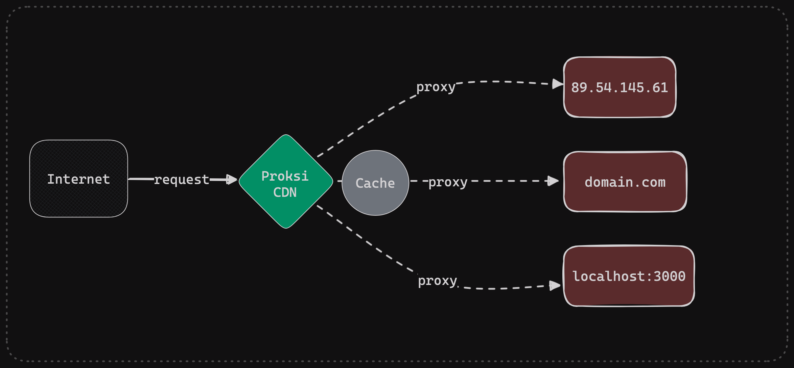

# 📓 Getting started

For a quick introduction, check the ASCII recording of a small configuration file for Proksi:



***


<div data-full-width="true">

<figure><figcaption><p>Proksi can be your reverse proxy or a load balancer in front of your public IPs</p></figcaption></figure>

</div>

**Proksi** is a **simple**, **lightweight**, and easy-to-use proxy server that automatically handles SSL, HTTP, and DNS traffic. It is designed to be used as a standalone proxy server or as a component in a larger system. Proksi is written in [Rust](https://www.rust-lang.org/) and uses [Cloudflare Pingora](https://blog.cloudflare.com/pingora-open-source) as its core networking library.


### Quick start

Create a configuration file

```bash
mkdir config
touch config/proksi.hcl
```

Add a simple route, let's try `docs.proksi.info` as our proxy route:

```hcl
# 
lets_encrypt {
  enabled = true
  staging = true
  email = "my@email.com"
}


paths {
  # Where to save certificates?
  lets_encrypt = "./"
  
  # You can even use functions here
  # lets_encrypt = env("HOME")
}

# A list of routes Proksi should handle
routes = [
  {
    # You might need to edit your /etc/hosts file here.
    host = "mysite.localhost",
    upstreams = [
     { 
       ip = "docs.proksi.info"
       port = 443
     }
    ]  
  }
]
```


## Features

Of the many features **Proksi** offers is the ability to **load balance** to your infrastructure or **any IP** that supports your host configurations. Other features of **Proksi** also include:

1. Automatic **Docker** and **Docker Swarm** service discovery through labels
2. Built-in most common middlewares such as **OAuth**, **Rate Limiting**, **CDN** **Caching** and others
3. The ability of running it as a single binary in your system
4. Automatic **SSL** through **Let's Encrypt** and redirection from HTTP to HTTPS
5. Configuration through **HCL with support for functions**&#x20;
6. Many others.

