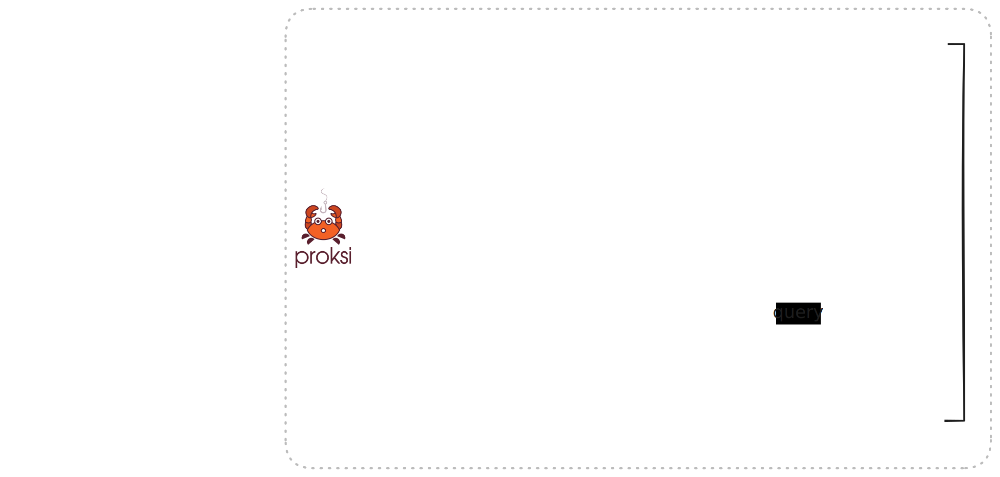

# Getting started

For a quick introduction, check the ASCII recording of a small configuration file for Proksi:



***

<figure><figcaption>
Proksi can be your reverse proxy or a load balancer in front of your public IPs
</figcaption></figure>

**Proksi** is a **simple**, **lightweight**, and easy-to-use proxy server that automatically handles SSL, HTTP, and DNS traffic. It is designed to be used as a standalone proxy server or as a component in a larger system. Proksi is written in [Rust](https://www.rust-lang.org/) and uses [Cloudflare Pingora](https://blog.cloudflare.com/pingora-open-source) as its core networking library.

## Features

Of the many features **Proksi** offers is the ability to load balance to your infrastructure or **any IP** that supports your host configurations. Other features of Proksi also include:

1. Automatic **Docker** and **Docker Swarm** service discovery through labels
2. Built-in most common middlewares such as OAuth, Rate Limiting, Caching and others
3. The ability of running it as a single binary in your system
4. Automatic SSL through Let's Encrypt and redirection from HTTP to HTTPS
5. Many others.

## Next Steps

Let's check how to use Proksi and the configuration options.

